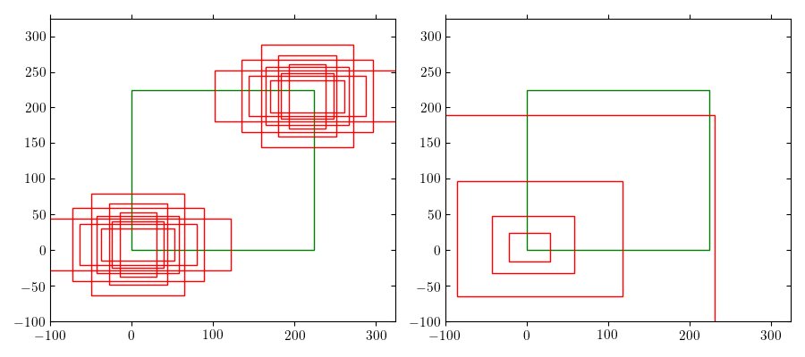

### RetinaNet Object Detection

Last update: May 2020.

---

This repository implements the RetinaNet architecture for single-shot object detction as described in [1], built on top of a ResNet-50 backbone [2]. Here we support the MSCOCO [3] and Pascal VOC [4] datasets. See the `out/` directory for examples from trained models.

#### Preliminaries

The object detection problem is joint *classification* and bounding box *regression*.
$$
\mathcal{L}(x, y, b) = \mathcal{L}_\mathrm{cls}(x,y) + \mathcal{L}_\mathrm{reg}(x, b)1\{y \neq 0\}
$$

Here $x$ is an image, $y$ is a label, and $b$ is a bounding box with four coordinates.

How do we do this? Given an image, we'll create a set of *anchor boxes* at varous (1) locations, (2) sizes, and (3) aspect ratios. In the left image below we show the anchor boxes for a fixed scale, at the bottom-left and top-right corners. In right image below we show the anchor boxes fixed at the bottom-left corner and default aspect ratio, across various sizes.

Each anchor box is responsible for its own $(|\mathcal{Y}|+1)$-way classification problem for the label, as well as its own 4-way regression problem for the bounding box delta. 

Below $(k, i, j, a)$ denotes the $a$-th anchor box at the $(i, j)$ coordinate, corresponding to the $k$-th feature map.
$$
\begin{align*}
\mathcal{L}_\mathrm{cls}^{(k, i, j, a)}(x,y) & = -\log p_\theta(y|x) & p_\theta(y|x) & = \mathrm{Bernoulli},y \in \{0,1\}^{|\mathcal{Y}|}\\
\mathcal{L}_\mathrm{reg}^{(k, i, j, a)}(x, b) & = -\log p_\theta(b|x) & p_\theta(b|x) & = \mathrm{Normal}, b\in\mathbb{R}^4
\end{align*}
$$
RetinaNet uses a *feature pyramid network* that takes advantage of the hierarchical layers of a convolutional neural network to naturally predict at the different scales of the different anchor boxes. That is, the largest anchor boxes correspond to higher  level feature maps and the smallest anchor boxes correspond to lower level feature maps. By default there are ~5 feature maps for a ResNet-50 backbone.

At prediction time we use non-maximum suppression to address redundancy in the overlapping anchor boxes.

**Data Representation**

Unfortunately we need to break abstractions between the model and data loader. 

In order to produce valid targets for the neural network (i.e. for the classification and regression problems above), the data loader needs to transform an image plus its set of bounding boxes into:
$$
(x, y, b) \mapsto (\mathrm{cls\ target}\in \{0,1\}^{K, M, N, A, |\mathcal{Y}|, }, \mathrm{reg\ target}\in\mathbb{R}^{K, M, N, A, 4})
$$

Note that above $K$ is the number of feature maps in the FPN, $M,N$ are the number of coordinates, and $A$ the number of anchor boxes per coordinate. 

We choose to do this transform in the `collate_fn` of the dataloader. The advantage of doing the target transformation in the loader instead of the model is that we can take advantage of PyTorch default dataloader multi-processing.

#### Focal Loss

We implement the suggested RetinaNet focal loss,
$$
\begin{align*}
\mathcal{L}_\mathrm{cls}^{(k, i, j, a)}(x,y) & = -\alpha^{(y)}(1-p_\theta(y|x)^\gamma\log p_\theta(y|x)\\
p_\theta(y|x) & = \mathrm{Bernoulli},\quad y \in \{0,1\}^{|\mathcal{Y}|}
\end{align*}
$$

Here $\alpha^{(y)} = \alpha 1\{y=1\} + (1-\alpha)1\{y=0\}$ is a scaling factor to address class imbalance in the training data (since there are far more negative labels than positive labels). Note that setting $\alpha=0.5$ and $\gamma=0$ recovers original log-likelihood. All final linear layer logits are initialized to prevalence level $\pi=0.01$.

#### References

[1] T. Lin, P. Goyal, R. Girshick, K. He, & P. Dollar, Focal Loss for Dense Object Detection. *2017 IEEE International Conference on Computer Vision (ICCV)* (2017), pp. 2999–3007. https://doi.org/10.1109/ICCV.2017.324.

[2] K. He, X. Zhang, S. Ren, & J. Sun, Deep Residual Learning for Image Recognition. *2016 IEEE Conference on Computer Vision and Pattern Recognition (CVPR)* (2016), pp. 770–778. https://doi.org/10.1109/CVPR.2016.90.

[3] T.-Y. Lin, M. Maire, S. Belongie, J. Hays, P. Perona, D. Ramanan, P. Dollár, & C. L. Zitnick, Microsoft COCO: Common Objects in Context. In D. Fleet, T. Pajdla, B. Schiele, & T. Tuytelaars,eds., *Computer Vision – ECCV 2014* (Cham: Springer International Publishing, 2014), pp. 740–755. https://doi.org/10.1007/978-3-319-10602-1_48.

[4] M. Everingham, L. Van Gool, C. K. I. Williams, J. Winn, & A. Zisserman, The Pascal Visual Object Classes (VOC) Challenge. *International Journal of Computer Vision*, **88** (2010) 303–338. https://doi.org/10.1007/s11263-009-0275-4.